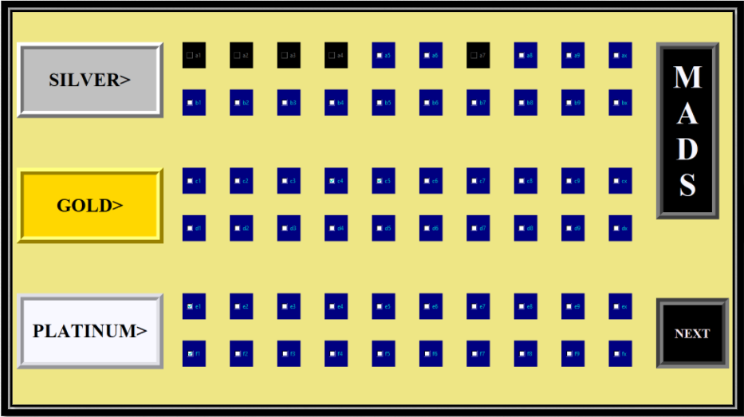

# Movie-Ticket-Booking
Python GUI to book movie Ticket online and Generate Bill.

====== ***Introduction*** =======  
The GUI design has login and Sign up system which keeps track of all registered users.  
The GUI design can be used to book tickets from particular theatres which can be connected with it through websites.
It uses BeautifulSoup and request modules of python to extract data from web about a movies and then gives the user his own comfort in deciding the time slots suitable for them.
It dynamically checks about the booked seats and presents their updated status in an interactive way. 
In addition to the movie poster, it also displays a short plot of the movie to explain the viewer what delight they would be in for when they sign up for a movie.
 It also has a Bill generator GUI where users who have booked tickets can generate their Bill statements.

====== ***Python Libraries*** =======  
Bs4 i.e BeautifulSoup (used for web scrapping), 
Math and Random,  
Requests, 
io,  
OS, 
PIL (Image, ImageTk), 
MessageBox, 
urllib.request.

====== ***Log-In Screen*** =======  
This is the Login Window where a pre-existing user can login to the GUI.
In addition to this there is a sign up button for new user’s registration

====== ***Sign-up Screen*** =======  
If a new User wants to Register his Records, there is a Sign-Up window >>

====== ***"Movie Options"*** =======  
Upon Successful Login or Sign-Up, Various Movie options from a particular theatre will be displayed here sequentially. ( The displayed movie is just for representation because all theatres and their web-sites are closed so web scrapping is unsuccessful for now. ). Here a poster and a short movie plot has been displayed from web along with a button for booking tickets. 

====== ***"Timing Options"*** =======  
If a user clicks ‘Interested’ button, multiple options regarding timings of the show are displayed. Clicking any show of user’s choice  will open the GUI of their seat arrangements.  

====== ***"Seat Booking System"*** =======  
#6 rows, 60 seats, 20 seats each under 3 different labels having different cost are displayed here. Already booked seats are disabled and displayed in black. Each time a user selects a seat, it is dynamically updated and in next call, the seat will be disabled. Clicking the next button will open Bill window.

====== ***"Bill Window"*** =======  
Here a user has to enter a number of parameters like Name, Contact info, Tickets selected etc. if any of these parameters is not entered, it will throw error through message boxes. 

====== ***"Bill Window"*** =======  
After completely filling all the data and generating bill, all the information will be saved properly. This data can then be used to retrieve all information about any particular bill number. 
Any pre-existing records can also be searched from the info stored in the directory. Like shown on the right, Bill No. 7100 was stored in the directory, hence it yielded the following result displayed in Bill Area.

====== ***THANK YOU..........*** =======  

